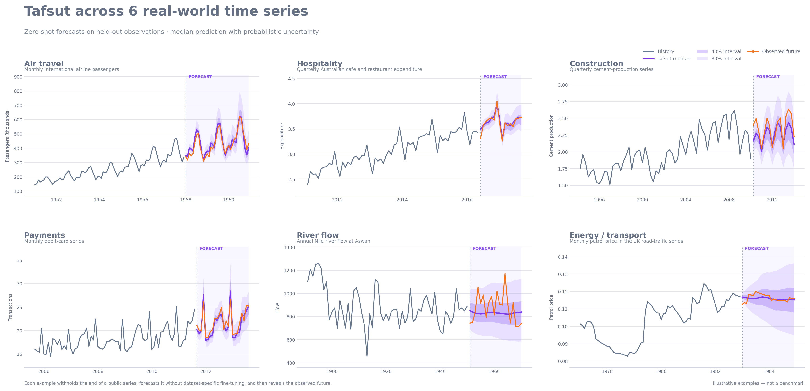
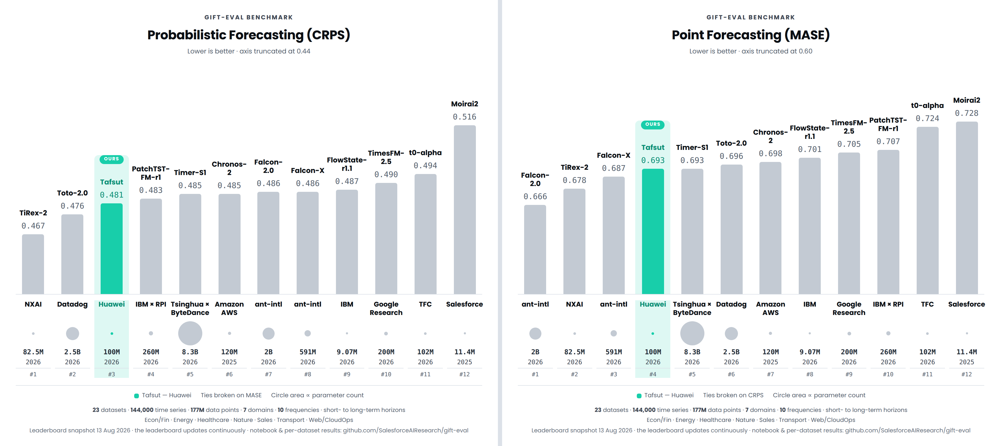

<div align="center">


# Tafsut

**Probabilistic time-series forecasting with pretrained models.**

<!--
PROJECT-OWNER INPUT REQUIRED — uncomment once each destination exists.
The license badge must wait until the project license is chosen.

[](https://pypi.org/project/tafsut/)
[](https://pypi.org/project/tafsut/)
[](LICENSE)
[](https://huggingface.co/Tafsut-FM/tafsut-univariate-base)
[](https://github.com/Tafsut-FM/tafsut/actions)
-->

[Quick start](#quick-start) · [Benchmarks](#benchmark-performance) · [API](#api) · [Architecture](#model-architecture) · [Model on 🤗](https://huggingface.co/Tafsut-FM/tafsut-univariate-base)

</div>

```bash
pip install tafsut
```

```python
from tafsut import TafsutModel, forecast

model = TafsutModel.from_pretrained(
    "Tafsut-FM/tafsut-univariate-base"
)
```
<div align="center">
  
</div>

<p align="center">
  <sub>Zero-shot probabilistic forecasts across real-world time series.</sub>
</p>

<div align="center">

|  |  |  |
| :-- | :-- | :-- |
| **Zero-shot** | **Probabilistic** | **Long context** |
| Forecast a new series with no retraining or per-series fine-tuning. | Nine quantiles per step: median forecast and its uncertainty. | Up to 32,768 historical observations, handled as temporal patches. |

</div>

---

## What Tafsut is

Give Tafsut a history of scalar observations and a horizon. It returns nine forecast quantiles (q0.1 through q0.9) for every future time step.

The released model, **Tafsut Univariate Base**, is a 105,315,648-parameter patch-based transformer encoder built for zero-shot inference. Weights live on the Hugging Face Hub and are downloaded and cached for you.

> [!NOTE]
> You never need to clone the Hugging Face repository or download `model.safetensors` by hand. `from_pretrained()` handles it.

---

## Installation

```bash
pip install tafsut                  # core
pip install "tafsut[visualization]" # + plotting
```

<details>
<summary><b>Requirements</b></summary>

<br>

| Package | Minimum |
| --- | --- |
| Python | 3.10 |
| PyTorch | 2.1 |
| NumPy | 1.24 |
| safetensors | 0.4 |
| huggingface_hub | 0.24 |
| matplotlib *(visualization extra)* | 3.7 |

Tafsut does not pin a CUDA-specific build of PyTorch. GPU users should install a PyTorch build matching their NVIDIA driver and CUDA environment first.

</details>

---

## Quick start

```python
import numpy as np

from tafsut import TafsutModel, forecast


model = TafsutModel.from_pretrained(
    "Tafsut-FM/tafsut-univariate-base"
)

context = np.random.default_rng(42).normal(
    size=512
).astype(np.float32)

prediction = forecast(
    model,
    context,
    horizon=128,
)

print(prediction.shape)
# torch.Size([1, 128, 9])
```

```text
axis 0 → batch
axis 1 → forecast horizon
axis 2 → quantile
```

---

## Benchmark performance

Evaluated on [GIFT-Eval](https://github.com/SalesforceAIResearch/gift-eval) 23 datasets, 144,000 time series, 177M data points, 7 domains, 10 frequencies, and short- to long-term horizons across Econ/Fin, Energy, Healthcare, Nature, Sales, Transport, and Web/CloudOps.



Among the twelve models compared here, Tafsut places **3rd on CRPS** (0.481) and **4th on MASE** (0.693) at 105M parameters — ahead of several entries one to two orders of magnitude larger. Lower is better on both metrics.

---

## Probabilistic outputs

Tafsut predicts quantiles, not a single point forecast:

```python
print(model.cfg.quantiles)
# (0.1, 0.2, 0.3, 0.4, 0.5, 0.6, 0.7, 0.8, 0.9)
```

| Want | Index | Quantile |
| --- | :---: | :---: |
| Median forecast | `prediction[..., 4]` | 0.5 |
| Lower bound | `prediction[..., 0]` | 0.1 |
| Upper bound | `prediction[..., 8]` | 0.9 |

`q0.1`–`q0.9` spans a nominal 80% forecast interval.

> [!TIP]
> In library code, look the index up from `model.cfg.quantiles` rather than hard-coding it — that keeps your code correct if the quantile configuration ever changes.

### Any horizon

Output patch size is 32 and the configured prediction length is 1,024, but `forecast()` accepts any positive horizon. It forecasts in blocks and, when more horizon is needed, extends the context with the median forecast before continuing. No manual loop required.

### Batches

```python
context = np.random.randn(16, 512).astype(np.float32)

prediction = forecast(model, context, horizon=96)
# (16, 96, 9)
```

### Missing observations

Encode gaps as `np.nan` and the validity mask is derived from the finite values:

```python
context = np.array([1.2, 1.4, np.nan, 1.8, 2.0], dtype=np.float32)
```

Or pass an explicit Boolean mask shaped like the context:

```python
prediction = forecast(
    model,
    context,
    context_mask=mask,
    horizon=128,
)
```

### Torch inputs and devices

```python
import torch

from tafsut import TafsutModel, forecast


model = TafsutModel.from_pretrained(
    "Tafsut-FM/tafsut-univariate-base",
    device="cuda",
)

context = torch.randn(8, 1024, device="cuda")

prediction = forecast(model, context, horizon=128)
```

`forecast()` currently returns its tensor on CPU:

```python
prediction_np = prediction.numpy()
prediction_np = prediction.detach().cpu().numpy()  # general form
```

> [!WARNING]
> Validate outputs with `torch.isfinite(prediction).all().item()`, not `np.isfinite(prediction)` — calling NumPy directly on the returned tensor can emit array-protocol deprecation warnings on recent NumPy versions.

---

## Visualization

```bash
pip install "tafsut[visualization]"
```

```python
import matplotlib.pyplot as plt

from tafsut.visualization import plot_forecast


fig, ax = plot_forecast(
    context,
    prediction,
    model.cfg.quantiles,
    target=future,          # optional observed future
    history_length=384,
    title="Tafsut forecast",
)

fig.savefig("forecast.png", dpi=180, bbox_inches="tight")
plt.show()
```

The plot renders observed history, the forecast origin, the median prediction, central quantile bands, optional observed future values, a selected series from a batch, and a configurable amount of history — rather than nine unexplained lines.

`tafsut.visualization.save_forecast_plot` writes a figure straight to a file.

---

## Command line

```bash
tafsut-forecast --context-file series.npy --horizon 128
```

Defaults to `Tafsut-FM/tafsut-univariate-base`; accepts `.npy` and `.json` arrays.

<details>
<summary><b>Saving plots and overlaying observed futures</b></summary>

<br>

```bash
tafsut-forecast \
    --context-file series.npy \
    --horizon 128 \
    --plot-output forecast.png
```

```bash
tafsut-forecast \
    --context-file history.npy \
    --target-file future.npy \
    --horizon 128 \
    --plot-output forecast.png
```

</details>

---

## API

```python
from tafsut import TafsutModel, forecast
```

Those two names are the whole public surface. Checkpoint internals, layer classes, and weight files stay out of your way.

#### `TafsutModel.from_pretrained(repo_or_path, **kwargs)`

Takes a Hugging Face repository ID or a local directory.

```python
model = TafsutModel.from_pretrained(
    "Tafsut-FM/tafsut-univariate-base",
    revision="main",
    cache_dir="./hf-cache",
)
```

| Argument | Effect |
| --- | --- |
| `device=` | `"cuda"` or `"cpu"`. Defaults to CUDA when PyTorch reports it available. |
| `revision=` | Pin a specific repository revision. |
| `token=` | Hugging Face access token. |
| `cache_dir=` | Override the download cache location. |
| `local_files_only=` | Load without contacting the Hub. |

Only inference files are fetched — `config.json` and `model.safetensors`, with `pytorch_model.bin` supported as an alternative weight format — cached through the standard Hugging Face cache.

#### `forecast(model, context, horizon=..., context_mask=None)`

Accepts a `numpy.ndarray` or `torch.Tensor` of shape `(T,)` for one series or `(B, T)` for a batch, converts to float32, and returns `(B, H, 9)`. Contexts longer than the window are truncated to their most recent 32,768 observations.

#### `model.save_pretrained(path)`

```text
my-tafsut/
├── config.json
└── model.safetensors
```

Reload with `TafsutModel.from_pretrained("./my-tafsut")`.

---

## Available models

| Model | Repository | Parameters |
| --- | --- | ---: |
| Tafsut Univariate Base | [`Tafsut-FM/tafsut-univariate-base`](https://huggingface.co/Tafsut-FM/tafsut-univariate-base) | 105,315,648 |

---

## Model architecture

```text
history → missing-value handling → instance normalization → temporal patching
       → patch embeddings → transformer encoder → quantile projection → forecast
```

| Property | Value |
| --- | ---: |
| Parameters | 105,315,648 |
| Architecture | Transformer encoder |
| Maximum context | 32,768 |
| Configured prediction length | 1,024 |
| Input patch size / stride | 32 / 32 |
| Output patch size | 32 |
| Layers | 14 |
| Hidden size | 768 |
| Attention heads | 12 |
| Head dimension | 64 |
| FFN size | 3,072 |
| Activation | ReLU |
| Output quantiles | 9 |
| Framework | PyTorch |
| Weight format | Safetensors |

Observations are grouped into non-overlapping patches of 32 steps, so a full context becomes `32,768 / 32 = 1,024` patches before any special model token — far cheaper than attending over every scalar. Each patch embedding combines normalized values, observation/missing-value state, and temporal patch structure.

Each of the 14 blocks runs RMS norm → multi-head self-attention → residual, then RMS norm → feed-forward → residual. Attention uses rotary positional embeddings (RoPE, theta 10,000) and `torch.nn.functional.scaled_dot_product_attention` where the installed PyTorch supports it, with an eager fallback.

Normalization is per series, computed from the visible context, with an arcsinh-based transformation enabled; forecasts are mapped back to the original scale before return.

> [!NOTE]
> Pass raw series values. There is no need to standardize each series yourself.


---

## Limitations

- **Univariate only**. This release is a univarite backbone with no covariates, exogenous variables, or cross-series structure.
- **Bounded context**. Inputs beyond 32,768 steps are truncated to their most recent portion.
- **Extended horizons**. Past the configured prediction length of 1,024, forecasts are produced by feeding the median back as context, so they are conditioned on the model's own median continuation.
- **Inference-focused release**. Training scripts, optimizer and scheduler state, and training checkpoint metadata are not included.
- **Benchmark scope**. The results above cover GIFT-Eval only, against the twelve models compared, at a single point in time.
---

## Training data and methodology

The model was trained in two stages:

1. **Synthetic pretraining:** approximately **40 million in-house generated synthetic time series**.
2. **Real-world post-training:** approximately **30 million real-world time series** drawn from the **GIFT-Eval pretraining corpus** and the **Chronos pretraining dataset**.

To prevent benchmark contamination, any time series overlapping with the evaluation benchmark were excluded from the training data.


---

## Project layout

<details>
<summary><b>Repository structure</b></summary>

<br>

```text
tafsut/
├── LICENSE
├── README.md
├── pyproject.toml
├── tafsut/
│   ├── __init__.py
│   ├── checkpoint.py
│   ├── config.py
│   ├── inference.py
│   ├── layers.py
│   ├── model.py
│   └── visualization.py

```

</details>

---

## Where things live

| Surface | Purpose |
| --- | --- |
| [PyPI](https://pypi.org/project/tafsut/) | Python package — `pip install tafsut` |
| [Hugging Face](https://huggingface.co/Tafsut-FM/tafsut-univariate-base) | Pretrained weights, configuration, model card |
| [GitHub](https://github.com/Tafsut-FM/tafsut) | Source, issues, examples, docs, development |


---

## License

This project is released under the **MIT License**. The full license is available in the [`LICENSE`](LICENSE) file and is reproduced below for convenience:

```text
MIT License

Copyright (c) 2026 Tafsut-FM

Permission is hereby granted, free of charge, to any person obtaining a copy
of this software and associated documentation files (the "Software"), to deal
in the Software without restriction, including without limitation the rights
to use, copy, modify, merge, publish, distribute, sublicense, and/or sell
copies of the Software, and to permit persons to whom the Software is
furnished to do so, subject to the following conditions:

The above copyright notice and this permission notice shall be included in all
copies or substantial portions of the Software.

THE SOFTWARE IS PROVIDED "AS IS", WITHOUT WARRANTY OF ANY KIND, EXPRESS OR
IMPLIED, INCLUDING BUT NOT LIMITED TO THE WARRANTIES OF MERCHANTABILITY,
FITNESS FOR A PARTICULAR PURPOSE AND NONINFRINGEMENT. IN NO EVENT SHALL THE
AUTHORS OR COPYRIGHT HOLDERS BE LIABLE FOR ANY CLAIM, DAMAGES OR OTHER
LIABILITY, WHETHER IN AN ACTION OF CONTRACT, TORT OR OTHERWISE, ARISING FROM,
OUT OF OR IN CONNECTION WITH THE SOFTWARE OR THE USE OR OTHER DEALINGS IN THE
SOFTWARE.
```


---
